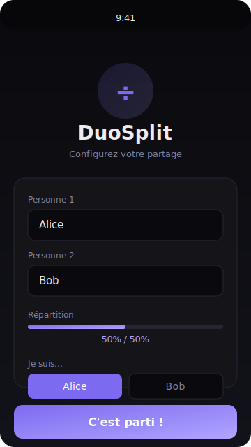
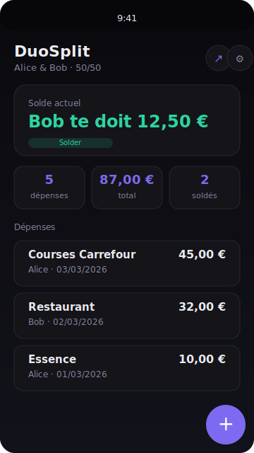
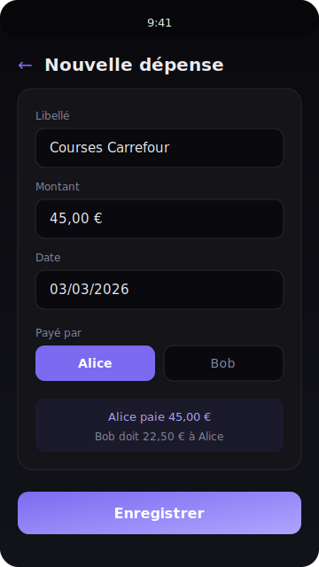
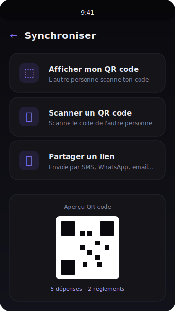

<div align="center">
  
  <h1>DuoSplit</h1>
  <p><strong>Partage de dépenses à deux, simple et clair.</strong></p>
  <p>
    
    
    
  </p>
</div>

---

DuoSplit est une Progressive Web App minimaliste pour partager les dépenses entre deux personnes (couple, coloc, amis...). Pas de compte, pas de serveur, tout reste sur votre appareil.

## Screenshots

<p align="center">
  
  &nbsp;&nbsp;
  
  &nbsp;&nbsp;
  
  &nbsp;&nbsp;
  
</p>
<p align="center">
  <em>Configuration · Tableau de bord · Nouvelle dépense · Synchronisation</em>
</p>

## Fonctionnalites

- **Suivi des depenses** — Ajoutez, modifiez et supprimez des depenses avec libelle, montant, date et payeur
- **Repartition flexible** — Ratio de partage configurable (pas seulement 50/50)
- **Solde en temps reel** — Calcul instantane de qui doit combien a qui
- **Historique des soldages** — Soldez les depenses et gardez un historique complet
- **Synchronisation sans serveur** — QR code, lien de partage (SMS, WhatsApp, email)
- **Fonctionne hors-ligne** — Service Worker pour une utilisation sans connexion
- **Installable** — Ajoutez l'app sur votre ecran d'accueil comme une app native

## Demarrage rapide

DuoSplit est un fichier HTML unique sans dependance. Pour le lancer :

```bash
# Cloner le depot
git clone https://github.com/Ayce45/DuoSplit.git
cd DuoSplit

# Lancer un serveur local (au choix)
python3 -m http.server 8000
# ou
npx http-server
# ou
php -S localhost:8000
```

Ouvrez `http://localhost:8000` dans votre navigateur. C'est tout !

> Pour installer en tant que PWA, utilisez le menu de votre navigateur ou le bouton "Installer" dans la barre d'adresse.

## Stack technique

| Composant | Technologie |
|-----------|-------------|
| Frontend | Vanilla JavaScript (zero framework) |
| Style | CSS avec variables (theme sombre) |
| Stockage | LocalStorage navigateur |
| Sync | QR codes + liens de partage |
| Offline | Service Worker |
| Fonts | Google Fonts (DM Sans) |
| QR | qrcodejs + jsQR (CDN) |

## Architecture

```
DuoSplit/
├── index.html       # Application complete (HTML + CSS + JS)
├── manifest.json    # Configuration PWA
├── sw.js            # Service Worker (cache offline)
├── icon-192.png     # Icone app 192x192
├── icon-512.png     # Icone app 512x512
└── screenshots/     # Captures d'ecran
```

L'application est un **fichier unique** (`index.html`) contenant toute la logique, le style et le markup. Pas de build, pas de bundler, pas de compilation.

## Licence

MIT
